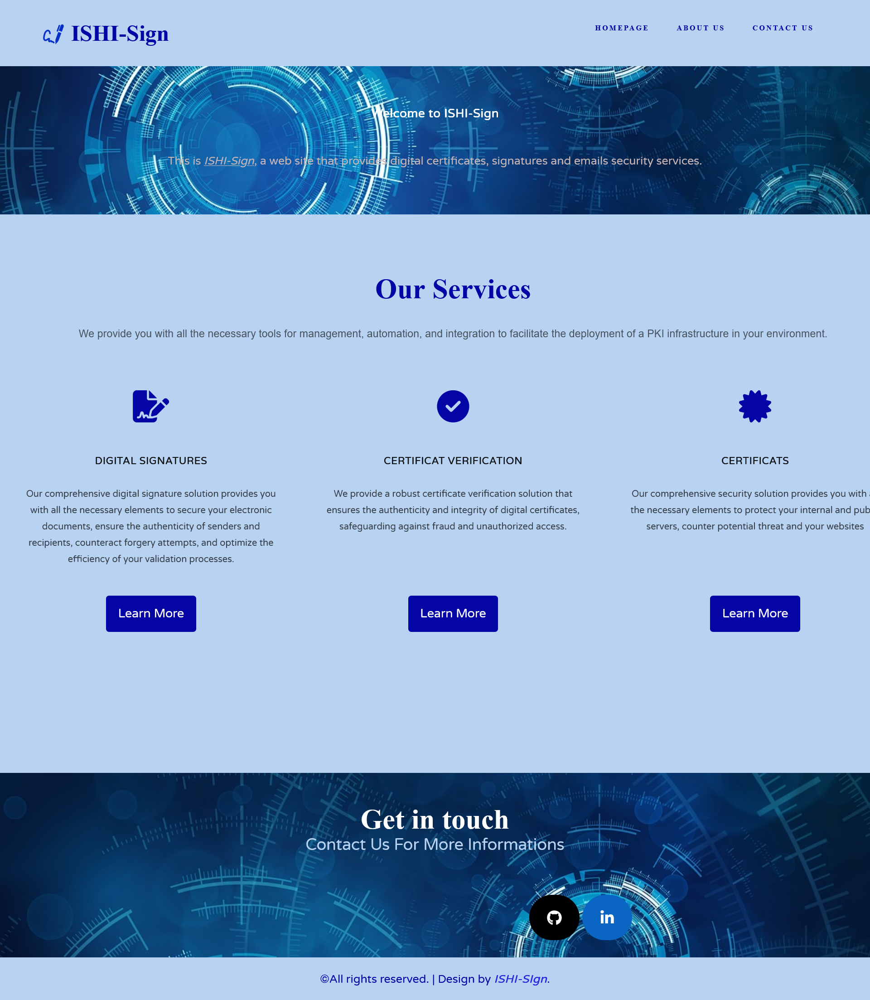
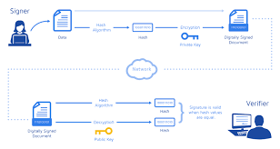
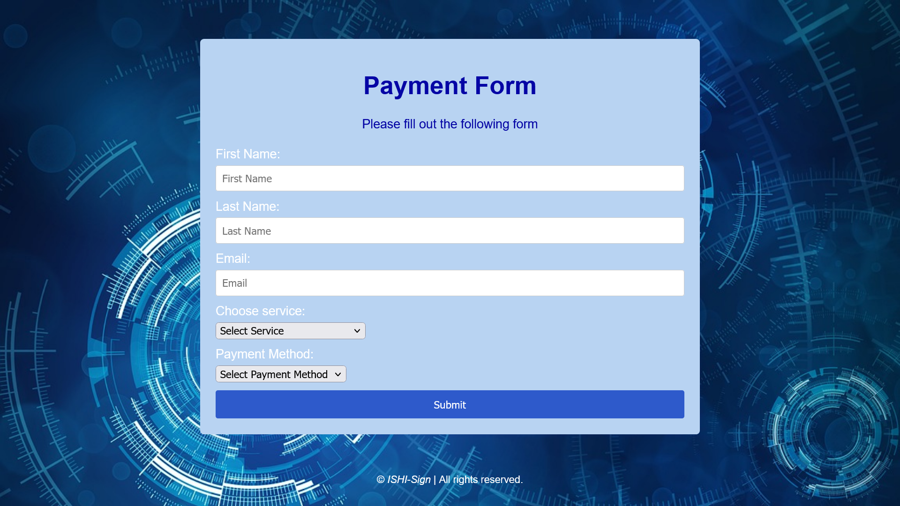

# ISHI-SIGN
## Introduction
At ISHI-Sign, we are dedicated to providing cutting-edge digital signature solutions to individuals and businesses. With a focus on security, authenticity, and efficiency, we offer a comprehensive suite of features to ensure the integrity of electronic documents.

## Services
We offer a range of services to meet your digital signature needs:
- **Digital Signatures**: Our advanced digital signature technology ensures the authenticity and integrity of your electronic documents.
  
- **Electronic Certificates**: We provide trusted electronic certificates for secure identification and encryption purposes.
  
- **Certificate Verification**: Our certificate verification service allows you to validate the authenticity of digital certificates issued by ISHI-Sign.

## Overview

**Home Page** :

 

**Digital Signatures** :

 A digital signature is a cryptographic technique used to ensure the authenticity, integrity, and non-repudiation of digital documents or messages. It provides a way to verify that a digital document or message has not been tampered with during transmission and that it was indeed sent by the claimed sender.

 

**ssl Certificate validity checker** :

Certificate verification services act as the gatekeepers of trust, enabling thorough examination and validation of digital certificates. Through a series of comprehensive checks, these services verify the integrity of certificates, confirm the identity of certificate holders, and ensure compliance with industry standards and regulations. By entrusting the verification process to specialized services, individuals and organizations can have full confidence in the validity of digital certificates. 

**ssl Certificate Generator** :

In today's interconnected world, where digital communication and transactions have become the norm, establishing trust and ensuring security is paramount. At the heart of this digital trust lies the powerful technology of digital certificates. These electronic credentials play a pivotal role in verifying identities, securing online interactions, and safeguarding sensitive information. Let's delve into the world of digital certificates and discover their significance in building a secure digital landscape. 

![certification generator(images/cert_generator.png)

**Payement Page** :

To access our services, you will be directed to a payment page where you can proceed to pay and gain access to the service.

